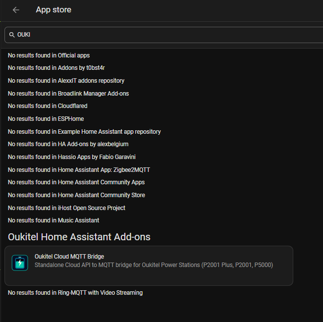
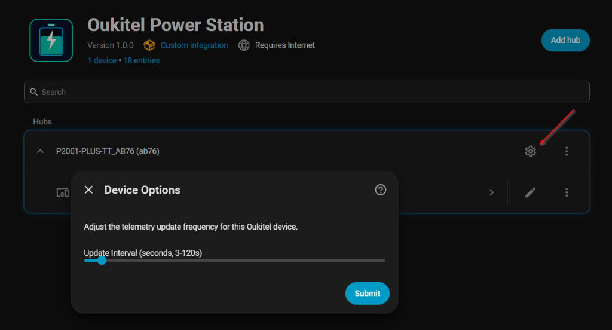

  
  <h1>Oukitel Home Assistant Add-ons ⚡</h1>

  
Collection of ready-to-run Home Assistant Add-ons for Oukitel Power Stations

  
  
  
  
  

---

## 🚀 Add Repository to Home Assistant

Click the button below to add this repository directly to your Home Assistant Add-on Store:

Or manually:
1. In Home Assistant, navigate to **Settings** -> **Add-ons** -> **Add-on Store**.
2. Click the three dots (top right) -> **Repositories**.
3. Add: `https://github.com/VictorCV-DAM/oukitel-hassio-addons` and click **Add**.

---

## 📦 Available Add-ons

> [!TIP]
> _All-in-one_ addons are configured to work completely stand-alone inside Home Assistant OS / Supervised.

### ⚡ Oukitel Power Station MQTT Bridge
_All-in-one_

Standalone background service that connects directly to Oukitel power stations via **Local LAN (TCP 6607, AES-128)** with automatic **Cloud API fallback**, publishing complete individual port telemetry, diagnostic health alarms, and bidirectional controls into Home Assistant via MQTT Discovery.

- **Dual Transport (LAN + Cloud)**: Instant sub-second local push with cloud fallback.
- **Individual Port Telemetry**: Discrete power monitoring for 4x Type-C, USB-A, Quick Charge, 12V DC, and 230V AC inverter output.
- **Native Hardware Fault Status ENUM**: Direct dropdown integration with Home Assistant automations for thermal, overload, and hardware protection.
- **Physics-Based Autonomy**: Real-time net energy balance engine ($$\text{net\_power} = \text{total\_input} - \text{total\_output}$$) eliminating firmware 99-hour overflows.
- **Interactive Remote Controls**: AC 230V, DC 12V, and USB switches, AC charge limit slider, and frequency/voltage selectors.
- **No Smartphone / No ADB Needed**: Fully autonomous daemon.
- **MQTT Auto-Discovery**: Automatic creation of all entities in Home Assistant.
- **Multi-Region**: Supports Europe (`EU`), North America (`US`), and China (`CN`).

[👉 View Add-on Documentation](oukitel-bridge/DOCS.md)

 

  <h3>🏪 Available in Home Assistant Add-on Store</h3>
  
  
<i>One-click installation via Home Assistant Supervised / OS Add-on Store.</i>

 

  <table width="100%">
    <tr>
      <td width="50%" align="center">
        <b>Multi-Region Cloud Setup</b>  
        
      </td>
      <td width="50%" align="center">
        <b>Automatic Discovery</b>  
        
      </td>
    </tr>
    <tr>
      <td width="50%" align="center">
        <b>Real-Time Telemetry & Controls</b>  
        
      </td>
      <td width="50%" align="center">
        <b>Adjustable Update Frequency</b>  
        
      </td>
    </tr>
  </table>

---

## 👨‍💻 Author & Intellectual Property

- **Author & Maintainer:** Víctor C. V. ([@VictorCV-DAM](https://github.com/VictorCV-DAM))
- **Email:** `victorcvtrabajo@gmail.com`
- **Copyright:** © 2024-2026 Víctor C. V. All rights reserved.
- **License:** Released under the [MIT License](LICENSE).

---

## 🔗 Related Projects & Alternative Deployments

* 🥇 **[ha-oukitel](https://github.com/VictorCV-DAM/ha-oukitel)**: Native Home Assistant Integration (GUI Config Flow, HACS).
* 🐍 **[oukitel-portable-bridge](https://github.com/VictorCV-DAM/oukitel-portable-bridge)**: Standalone cross-platform Python MQTT daemon (Linux/Windows/macOS).

---

## ☕ Support & Donations

If this add-on has helped you integrate your power station effortlessly into Home Assistant OS, consider supporting continuous development and maintenance:

- ☕ **Buy Me a Coffee:** [buymeacoffee.com/VictorCV](https://www.buymeacoffee.com/VictorCV)
- 🅿️ **PayPal:** [paypal.me/victorcava](https://www.paypal.me/victorcava)
- 🔴 **Ko-fi:** [ko-fi.com/victorcv](https://ko-fi.com/victorcv)
- 💖 **GitHub Sponsors:** [github.com/sponsors/VictorCV-DAM](https://github.com/sponsors/VictorCV-DAM)

Thank you for your support! ⭐

---

## ⚖️ Disclaimer

This project is an independent community development and is not affiliated with, sponsored by, or endorsed by Oukitel or Quectel/Acceleronix. All product names, logos, and brands are property of their respective owners.
